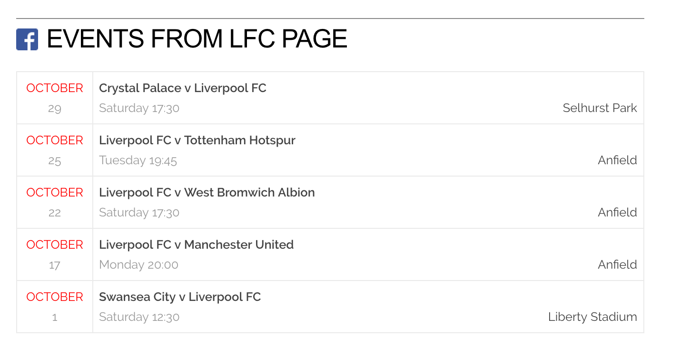

# Grav Facebook Plugin (DSA Fork)

`Facebook` is a simple [Grav][grav] Plugin that includes your Facebook page content to your Grav website. Plugin can be used to get any public Facebook page content.

### Events example



# Installation

Installing the Facebook plugin can be done in one of two ways. Using GPM (Grav Package Manager) installation method enables you to quickly and easily install the plugin with a simple terminal command, while the manual method enables you to do so via a zip file.

## Manual Installation

To install this plugin, just download the zip version of this repository and unzip it under `/your/site/grav/user/plugins`. Then, rename the folder to `facebook`. You can find these files either on [GitHub](https://github.com/mikahanninen/grav-plugin-facebook) or via [GetGrav.org](http://getgrav.org/downloads/plugins#extras).

You should now have all the plugin files under

    /your/site/grav/user/plugins/dsa_facebook

# Configuration

You need to provide few configurations in order for the feed show up. In your Grav Administration panel, go to Plugins > Facebook to view the plugin configuration page.

Enter the Facebook *page_id* which feed you want to show, and your Facebook API *application_id* and *application_secret*.

For more information how to get application set up, see the [Facebook Developers documentation](https://developers.facebook.com/).

# Customization

To customize how the your feed looks like, you might want to customize the generated markup. To do that, copy the template file [facebook.html.twig](templates/partials/facebook.html.twig) to your `templates/partials` folder of your theme. For example:

```
/your/site/grav/user/themes/custom-theme/templates/partials/facebook.html.twig
```

It will now override the default markup of the feed. You can tweak it however you like.

# Config Defaults

If you need to override some plugin default values, the best practise is to copy the [facebook.yaml](facebook.yaml) file into your `users/config/plugins/` folder (create it if it doesn't exist), and then modify there. This will override the default settings.

Facebook *page_id* can be found with service like [Find your Facebook ID](http://findmyfbid.com/).

# Getting Facebook Events

You simply need to include a function your template file such as:

```
{{ facebook_events() }}
```

This will be converted into your Facebook events as follows:

```
<div id='facebook-events'>
{{ sectionTitle }}
<table>
  <tr class='facebook-event'>
    <td class='start-date'>
      <span class='month'>{{ event.start_time.monthName }}</span>
      <span class='day'>{{ event.start_time.day }}</span>
    </td>
    <td class='details'>
      <span class='name'>{{ event.name }}</span><span class='location'>{{ event.place }}</span>
      <span class='period'>{{ event.period }}</span>
    </td>
  </tr>
  ...
</table>
</div>
```